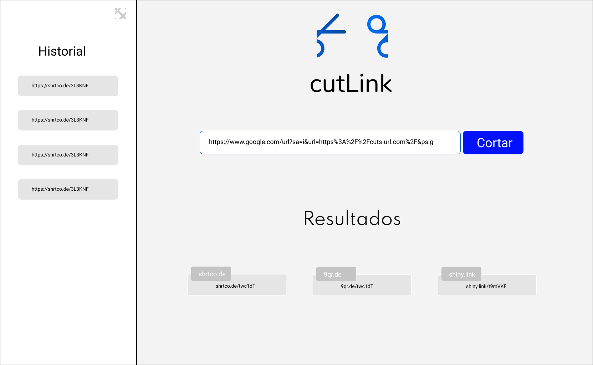
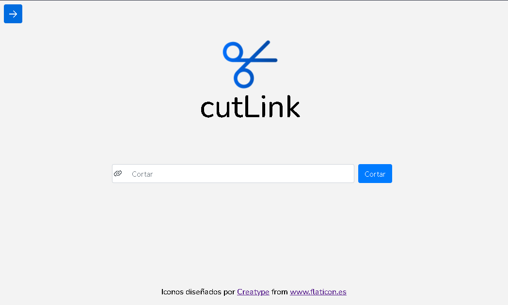
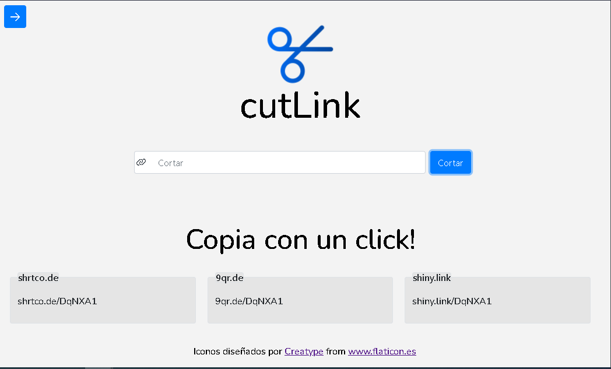
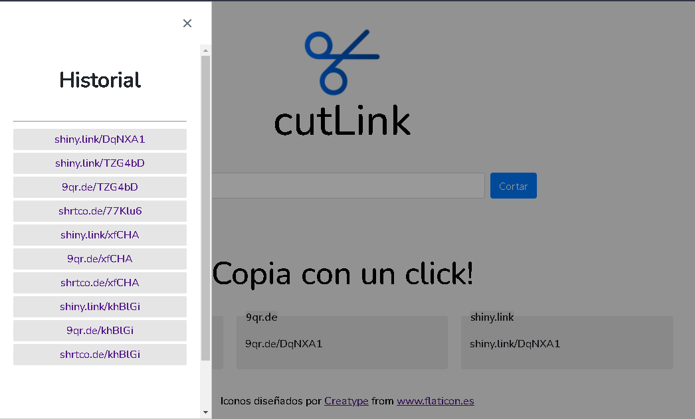
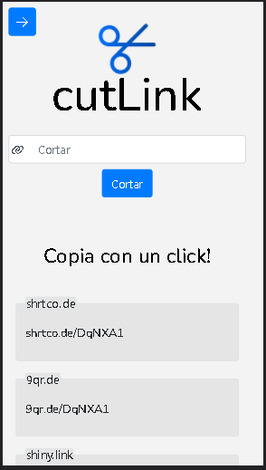

## Table of contents

- [Overview](#overview)
  - [The challenge](#the-challenge)
  - [Figma](#figma)
  - [Solution](#solution)
  - [Links](#links)
- [My process](#my-process)
  - [Built with](#built-with)
  - [Process](#process)
  - [Fonts and colors](#fonts-and-colors)


## Overview

### The challenge
URL shortener landing page

Users should be able to:

- Shorten any URL.
- Show history of shortened links.
- Click to copy.


Estimated development time: 24 hrs.
Real development time: 22 hrs.

Estimated build time: 40 seg.
Real time of build: 47 seg.

### Figma



### Solution





### Links

- Solution URL: [cutLink](https://cut-linkk.herokuapp.com/)

## My process

### Built with

- Semantic HTML5 markup
- SCSS custom properties
- PimeNG
- [Angular](https://angular.io/) - Angular framework


### Process
#### Get started

First we are going to create a new angular application.

```shell
ng new shrtCode
```
To work with the styles and the dynamic elements we use PrimeNg, so we will do the installation.

```shell
npm install primeng primeicons
```
The configuration process of PrimeNg can be found on its official page at the following link:
[PrimeNG](https://primefaces.org/primeng/showcase/#/setup)

Now, within the application we will create a new module with the following command:

```shell
ng g m primeNg
```

The function of this module is to import and export the PrimeNG own modules that are required, it is a way to better organize the code.
This will look something like this:

```js
import { NgModule } from '@angular/core';
import { CommonModule } from '@angular/common';
import {InputTextModule} from 'primeng/inputtext';
import {ButtonModule} from 'primeng/button';
import {FieldsetModule} from 'primeng/fieldset';
import {SidebarModule} from 'primeng/sidebar';
import {MessagesModule} from 'primeng/messages';
import {MessageModule} from 'primeng/message';
import {ToastModule} from 'primeng/toast';

@NgModule({
  declarations: [],
  imports: [
    CommonModule
  ],
  exports:[
    CommonModule,
    InputTextModule,
    ButtonModule,
    FieldsetModule,
    SidebarModule,
    MessagesModule,
    MessageModule,
    ToastModule
  ]
})
export class PrimeNgModule { }

```
#### shrtcode API - service

In order to process the URLs, the shrtcode REST API was used, the official documentation can be found at the following link [shrtcode API](https://shrtco.de/docs/)

The following service is created in which the request to the API is made.

```js
import { Injectable } from '@angular/core';
import { HttpClient } from "@angular/common/http";
import { URLResponse } from '../interfaces/url.interface';
import { ErrorResponse } from '../interfaces/error.interface';

@Injectable({
  providedIn: 'root'
})
export class CutUrlService {

  private urlApi: string = 'https://api.shrtco.de/v2/shorten?url';

  public results!: URLResponse;
  public resultsR!: URLResponse;
  public error!: ErrorResponse;
  public errorR!: ErrorResponse;

  constructor(private http: HttpClient) { }

  cutUrl (termino: string){
    const url = `${this.urlApi}=${termino}`;
    this.http.get<URLResponse>(url).subscribe(

      result => {
        this.error = this.errorR;
        this.results = result;
      },
      error => {
        this.results = this.resultsR;
        this.error = error.error;
      }
    )
  }

}
```
The cutUrl method receives a string term which will be the URL to be cut, and then the response is stored in the "results" and "error" properties respectively.

#### Input Component

Now we create a component called "input" to receive the URL to be processed.

```shell
ng g c pages/input --skip-tests
```
Inside the input.component.html we will have an <input> in which we will enter the URL with the keydown.enter event through which the value will be sent.

```html
    <input [(ngModel)]= "input" #inputUrl type="text" pInputText placeholder="Cortar" class="col-12 md:col-12 lg:col-12" (keydown.enter)="value(inputUrl.value)" />
```

On the other hand, inside the input.component.ts we will have the method "value" which will receive the URL to be able to make use of it inside the same method. First a constant is created in which its value is the result of the validation of the URL by means of a regular expression, this to validate if what is being entered is or not a valid URL.

```js
  value(url: string){

    const control = new FormControl(url, Validators.pattern('https?:\/\/(?:www\.|(?!www))[a-zA-Z0-9][a-zA-Z0-9-]+[a-zA-Z0-9]\.[^\s]{2,}|www\.[a-zA-Z0-9][a-zA-Z0-9-]+[a-zA-Z0-9]\.[^\s]{2,}|https?:\/\/(?:www\.|(?!www))[a-zA-Z0-9]+\.[^\s]{2,}|www\.[a-zA-Z0-9]+\.[^\s]{2,}'));

    if(url && !control.errors){
      this.urlServiceValue.cutUrl(url);
      this.input = '';
    }else{
      this.showError();
      return
    }
  }

```
By means of the conditional "if" it is validated that there is a URL with the appropriate format, if the condition is true then the service created before is called passing as a parameter the same URL.

#### Results component

Now we created a component to be able to receive the response from our service, this component will be called "results"

```shell
ng g c pages/results
```
Inside results.component.ts two "get" methods are created for one called "results" to store the data of the successful response and another called "error" in case the request was not successful.

```js
  get resultados(){
    return this.urlServiceRe.results;
  }

  get error(){

    return this.urlServiceRe.error;
  }
```
We can now represent the data with the following structure inside the results.component.html haciendo uso de algunas etiquetas proporcionadas por primeNG.

```html
      <p-fieldset (click)="copy(short_link.textContent)" class="col-12 md:col-6 lg:col-4 cursor-pointer" legend="shrtco.de">
        <p #short_link>{{resultados.result.short_link}}</p>
      </p-fieldset>


    <p-fieldset (click)="copy(short_link2.textContent)" class="col-12 md:col-6 lg:col-4 cursor-pointer" legend="9qr.de">
      <p #short_link2>{{resultados.result.short_link2}}</p>
    </p-fieldset>

    <p-fieldset (click)="copy(short_link3.textContent)" class="col-12 md:col-12 lg:col-4 cursor-pointer" legend="shiny.link">
      <p #short_link3>{{resultados.result.short_link3}}</p>
    </p-fieldset>

    <p-message severity="error" [text]=" 'Código: ' + error.error_code + ' ' + 'Detalles: ' + error.error"></p-message>
```
#### History service

This service will be created in order to store the last links copied by the user and save then in memory, this service will be called "historial".

```shell
ng g s services/historial --skip-tests
```
A private property is created in which the data will be stored.

```js
private _historal: string[] = [];
```
A get method that returns the value of the previous property.

```js
  get historial(){
    return [...this._historal];
  }
```
The following is placed inside the constructor to be able to retrieve the stored data every time the page is reloaded.

```js
 constructor(){

    this._historal = JSON.parse(localStorage.getItem('urlHistorial')!) || [];

  }
```

And finally the method in charge of storing the data in memory, always keeping a total of 10 registers.

```js
  insertarHistorial(value: string){

    if(!this._historal.includes(value)){
      this._historal.unshift(value);

      localStorage.setItem('urlHistorial', JSON.stringify(this._historal));
    }
    this._historal = this._historal.splice(0,10);
  };
```

#### Sidebar component
Now all that remains is to create the component in which the history will be displayed.

```shell
ng g c shared/sidebar --skip-tests
```

Inside the sidebar.component.ts the data is received with a get method.

```js
  get historial(){
    return this.getHistorial.historial;
  }
```

And inside sidebar.component.html with the help of an *ngFor directive we can represent each of the data as follows:

```html
<div (click)="copy(txtSidebar.text)" *ngFor="let elemento of historial"  class="flex justify-content-center align-items-center historiale  h-2rem">
      <a href="#" class="listado" #txtSidebar>
        {{elemento}}
      </a>
</div>
```

Note that a "copy" method is called, which fulfills the function of being able to copy the current data value with a single click, the method is as follows:

```js
copy(textCopy: any){
    const selBox = document.createElement('textarea');
    selBox.style.position = 'fixed';
    selBox.style.left = '0';
    selBox.style.top = '0';
    selBox.style.opacity = '0';
    selBox.value = textCopy;
    document.body.appendChild(selBox);
    selBox.focus();
    selBox.select();
    document.execCommand('copy');
    document.body.removeChild(selBox);
    this.showCopy();
  }
  showCopy() {
    this.messageService.add({key: 'tc', severity:'info', summary: 'Copiado'});
  }
```

With showCopy a confirmation message is displayed to the user that the item has been copied to the clipboard.

### Fonts and colors

Body:
- primary color: #F3F3F3;

Buttons:
- primary color: #007bff;

Font:
- font-family: 'Nunito', sans-serif;

